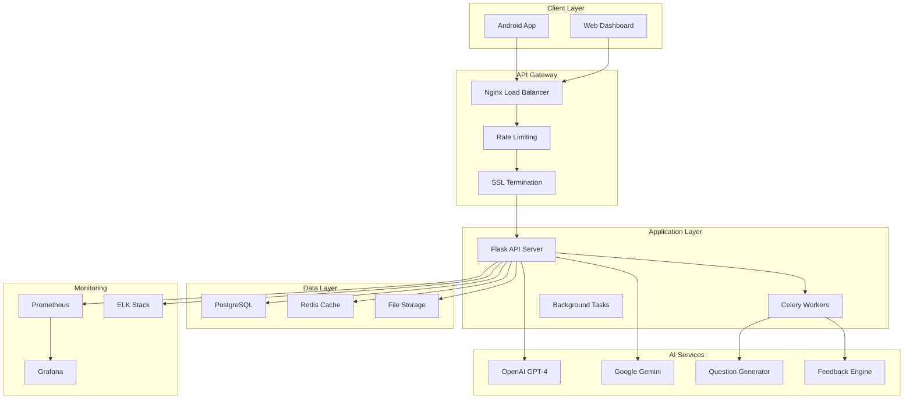

# Smart Quiz App - AI-Powered Learning Platform

[](https://github.com/locfaker/Smart-Quiz-App---AI-Powered-Learning-Platform-by-LocDev/actions)
[](https://codecov.io/gh/locfaker/Smart-Quiz-App---AI-Powered-Learning-Platform-by-LocDev)
[](https://sonarcloud.io/dashboard?id=Smart-Quiz-App---AI-Powered-Learning-Platform-by-LocDev)
[](https://opensource.org/licenses/MIT)

## 🎯 Tổng quan dự án

Smart Quiz App là một nền tảng học tập thông minh sử dụng AI để tạo câu hỏi cá nhân hóa và cung cấp phản hồi chi tiết. Dự án được phát triển theo tiêu chuẩn enterprise với kiến trúc Clean Architecture, tích hợp AI thực tế, và pipeline CI/CD hoàn chỉnh.

### 🏆 Điểm nổi bật

- **AI-Powered**: Tích hợp OpenAI GPT-4 và Google Gemini để tạo câu hỏi và phản hồi thông minh
- **Enterprise Architecture**: Clean Architecture với SOLID principles
- **Production-Ready**: Docker, Kubernetes, CI/CD pipeline hoàn chỉnh
- **High Performance**: Redis caching, database optimization, lazy loading
- **Security First**: JWT authentication, rate limiting, data encryption
- **Scalable**: Microservices architecture, horizontal scaling
- **Monitoring**: Prometheus, Grafana, comprehensive logging

## 🏗️ Kiến trúc hệ thống



## 🚀 Tính năng chính

### 📱 Android Application
- **Material Design 3**: UI/UX hiện đại, responsive
- **Offline Support**: Sync dữ liệu khi có kết nối
- **Real-time Updates**: WebSocket cho cập nhật tức thời
- **Biometric Authentication**: Bảo mật sinh trắc học
- **Dark/Light Theme**: Hỗ trợ theme tự động

### 🤖 AI-Powered Features
- **Smart Question Generation**: Tạo câu hỏi dựa trên độ khó và chủ đề
- **Personalized Feedback**: Phân tích chi tiết và gợi ý cải thiện
- **Adaptive Learning**: Điều chỉnh độ khó dựa trên hiệu suất
- **Content Recommendation**: Gợi ý nội dung học tập phù hợp

### 📊 Analytics & Monitoring
- **Real-time Metrics**: Theo dõi hiệu suất hệ thống
- **User Analytics**: Phân tích hành vi người dùng
- **Performance Monitoring**: APM với distributed tracing
- **Error Tracking**: Sentry integration cho error monitoring

## 🛠️ Tech Stack

### Frontend (Android)
- **Language**: Kotlin
- **Architecture**: MVVM + Clean Architecture
- **DI**: Hilt (Dagger)
- **Database**: Room + SQLite
- **Network**: Retrofit + OkHttp
- **UI**: Jetpack Compose + Material Design 3
- **Testing**: JUnit, Espresso, Mockito

### Backend (API Server)
- **Language**: Python 3.11
- **Framework**: Flask + SQLAlchemy
- **Database**: PostgreSQL 15
- **Cache**: Redis 7
- **Queue**: Celery + Redis
- **AI**: OpenAI GPT-4, Google Gemini
- **Testing**: pytest, coverage

### DevOps & Infrastructure
- **Containerization**: Docker + Docker Compose
- **Orchestration**: Kubernetes
- **CI/CD**: GitHub Actions
- **Monitoring**: Prometheus + Grafana
- **Logging**: ELK Stack
- **Security**: OWASP compliance

## 📋 Yêu cầu hệ thống

### Development Environment
- **Android Studio**: Arctic Fox hoặc mới hơn
- **JDK**: 17+
- **Python**: 3.11+
- **Node.js**: 18+ (cho tools)
- **Docker**: 20.10+
- **PostgreSQL**: 15+
- **Redis**: 7+

### Production Environment
- **CPU**: 4+ cores
- **RAM**: 8GB+ (16GB recommended)
- **Storage**: 100GB+ SSD
- **Network**: 1Gbps+
- **OS**: Ubuntu 22.04 LTS

## 🚀 Cài đặt và chạy

### 1. Clone Repository
```bash
git clone https://github.com/username/smart-quiz-app.git
cd smart-quiz-app
```

### 2. Setup Environment Variables
```bash
cp server/.env.example server/.env
# Cập nhật các API keys và cấu hình trong .env
```

### 3. Start với Docker Compose
```bash
# Development
docker-compose -f docker-compose.dev.yml up -d

# Production
docker-compose up -d
```

### 4. Build Android App
```bash
./gradlew assembleDebug
# hoặc
./gradlew assembleRelease
```

### 5. Database Migration
```bash
cd server
flask db upgrade
```

## 🧪 Testing

### Backend Testing
```bash
cd server
python -m pytest tests/ -v --cov=. --cov-report=html
```

### Android Testing
```bash
# Unit Tests
./gradlew testDebugUnitTest

# Instrumented Tests
./gradlew connectedDebugAndroidTest

# UI Tests
./gradlew connectedDebugAndroidTest -Pandroid.testInstrumentationRunnerArguments.class=com.smartquiz.app.ui.MainActivityTest
```

### Performance Testing
```bash
k6 run tests/performance/load-test.js
```

## 📊 Monitoring & Observability

### Metrics Dashboard
- **URL**: http://localhost:3000 (Grafana)
- **Username**: admin
- **Password**: Xem trong docker-compose.yml

### Key Metrics
- **Response Time**: P95 < 200ms
- **Throughput**: 1000+ RPS
- **Error Rate**: < 0.1%
- **Uptime**: 99.9%+

### Alerts
- High error rate (> 1%)
- Slow response time (> 500ms)
- Database connection issues
- Memory usage > 80%

## 🔒 Security

### Authentication & Authorization
- **JWT Tokens**: Secure token-based auth
- **Rate Limiting**: API rate limiting per user
- **CORS**: Configured for production domains
- **HTTPS**: SSL/TLS encryption

### Data Protection
- **Encryption**: AES-256 for sensitive data
- **Password Hashing**: bcrypt with salt
- **SQL Injection**: Parameterized queries
- **XSS Protection**: Input sanitization

### Security Scanning
- **SAST**: SonarQube static analysis
- **DAST**: OWASP ZAP dynamic testing
- **Dependency Scanning**: Snyk vulnerability checks
- **Container Scanning**: Trivy security scans

## 📈 Performance Optimization

### Backend Optimizations
- **Database Indexing**: Optimized queries với indexes
- **Connection Pooling**: PostgreSQL connection pooling
- **Caching Strategy**: Multi-level caching với Redis
- **Async Processing**: Celery cho background tasks

### Android Optimizations
- **Memory Management**: Proper lifecycle management
- **Image Loading**: Glide với caching
- **Network Optimization**: Request batching và compression
- **Battery Optimization**: Background task optimization

## 🚀 Deployment

### Staging Environment
```bash
# Deploy to staging
kubectl apply -f k8s/staging/
```

### Production Deployment
```bash
# Deploy to production
kubectl apply -f k8s/production/
```

### Blue-Green Deployment
```bash
# Switch traffic to new version
kubectl patch service smartquiz-service -p '{"spec":{"selector":{"version":"v2"}}}'
```

## 📚 API Documentation

### Base URL
- **Development**: http://localhost:5000/api/v1
- **Production**: https://api.smartquiz.app/v1

### Authentication
```bash
# Login
curl -X POST /api/v1/auth/login \
  -H "Content-Type: application/json" \
  -d '{"username":"user","password":"pass"}'

# Use token
curl -H "Authorization: Bearer <token>" /api/v1/questions/generate
```

### Key Endpoints
- `POST /auth/login` - User authentication
- `POST /questions/generate` - Generate AI questions
- `POST /feedback/generate` - Generate AI feedback
- `GET /analytics/user-stats` - User statistics
- `GET /health` - Health check

## 🤝 Contributing

### Development Workflow
1. Fork repository
2. Create feature branch: `git checkout -b feature/amazing-feature`
3. Commit changes: `git commit -m 'Add amazing feature'`
4. Push to branch: `git push origin feature/amazing-feature`
5. Open Pull Request

### Code Standards
- **Kotlin**: Follow Android Kotlin style guide
- **Python**: PEP 8 compliance
- **Testing**: Minimum 80% code coverage
- **Documentation**: Comprehensive inline docs

### Pull Request Process
1. Update README.md với changes
2. Ensure all tests pass
3. Update version numbers
4. Get approval từ maintainers

## 📄 License

Dự án này được phân phối dưới MIT License. Xem [LICENSE](LICENSE) để biết thêm thông tin.

## 👥 Team

- **Lead Developer**: lộc võ
- **Backend Developer**: lộc võ
- **Mobile Developer**: lộc võ
- **DevOps Engineer**: lộc võ

## 📞 Support

- **Email**: locv2659@gmail.com
- **Documentation**: https://docs.smartquiz.app
- **Issues**: https://github.com/locfaker/DFS/issues
- **Discussions**: https://github.com/locfaker/DFS/discussions

## 🎯 Roadmap

### Q1 2024
- [ ] Multi-language support
- [ ] Voice questions
- [ ] AR/VR integration
- [ ] Advanced analytics

### Q2 2024
- [ ] Machine Learning recommendations
- [ ] Social features
- [ ] Gamification
- [ ] Mobile web app

---

**⭐ Nếu dự án này hữu ích, hãy cho chúng tôi một star trên GitHub!**