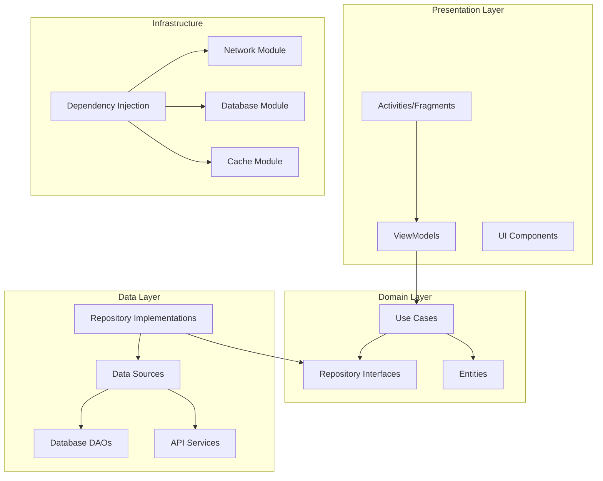
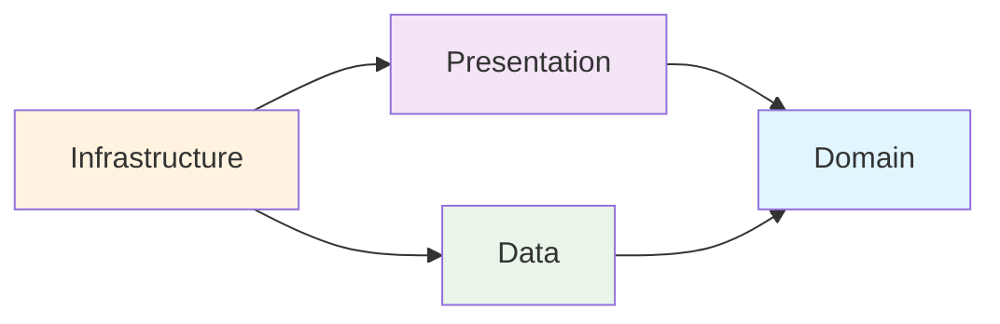
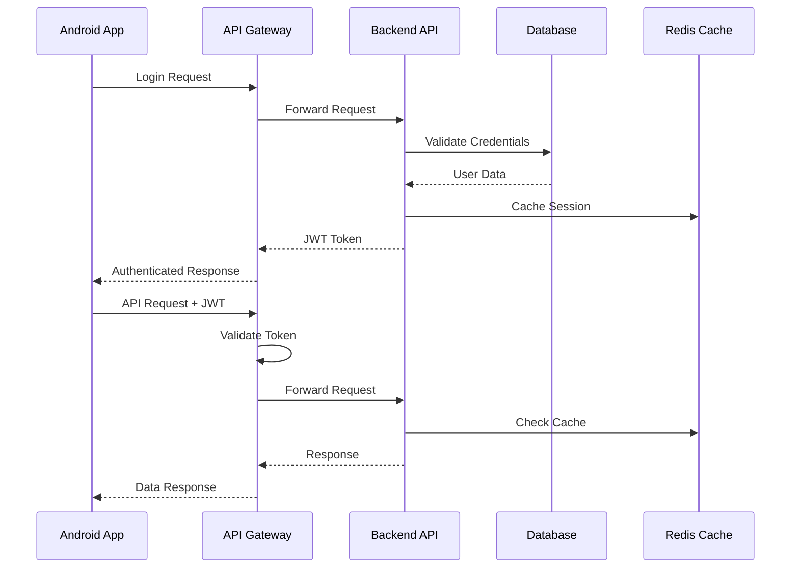
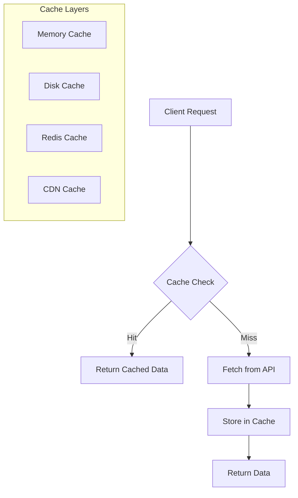
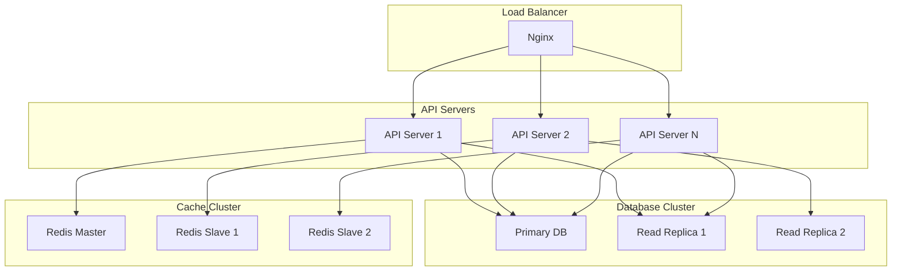
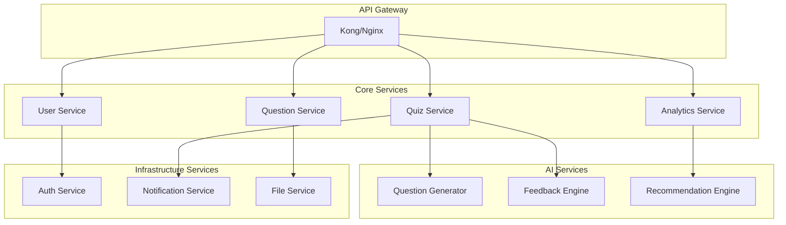
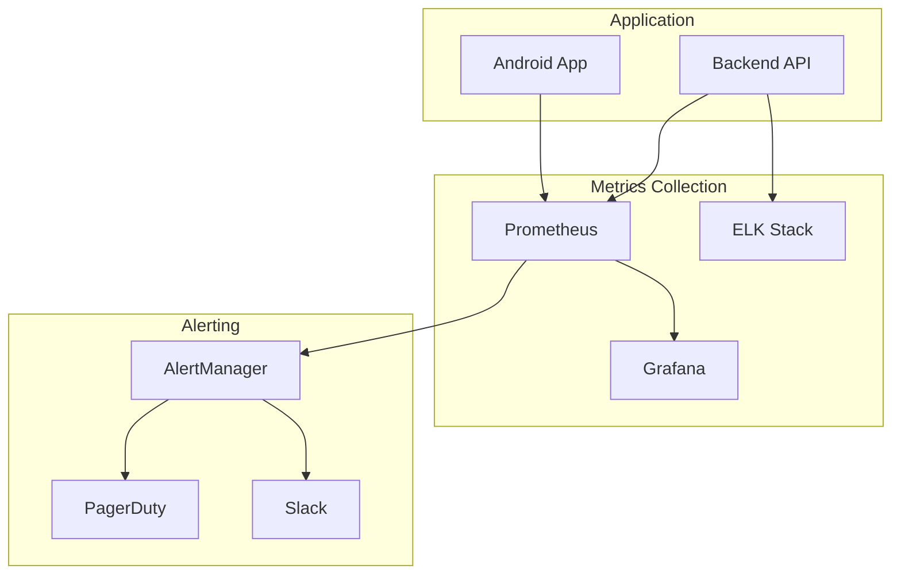
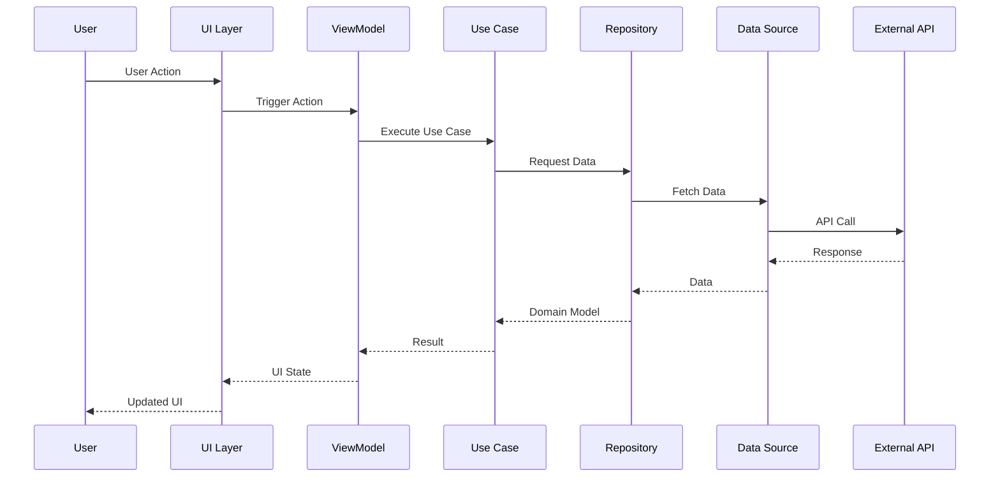
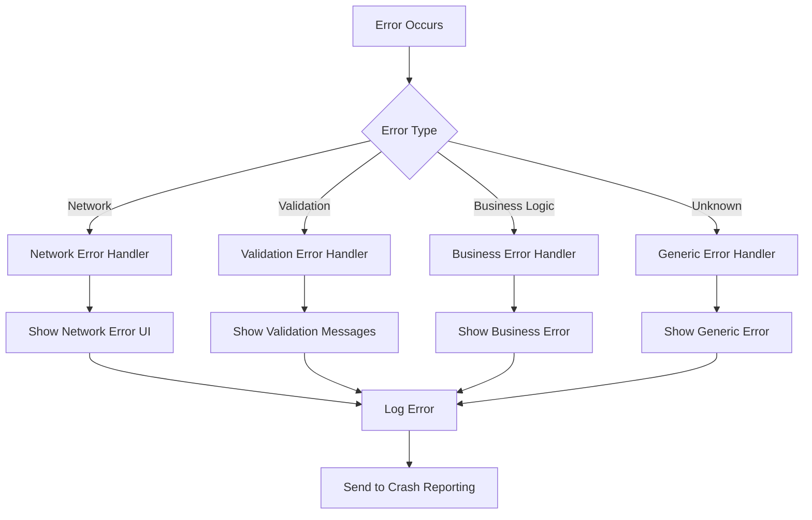

# Smart Quiz App - Architecture Documentation

## 📋 Mục lục

1. [Tổng quan kiến trúc](#tổng-quan-kiến-trúc)
2. [Clean Architecture Implementation](#clean-architecture-implementation)
3. [Domain Layer](#domain-layer)
4. [Data Layer](#data-layer)
5. [Presentation Layer](#presentation-layer)
6. [Infrastructure Layer](#infrastructure-layer)
7. [Security Architecture](#security-architecture)
8. [Performance Architecture](#performance-architecture)
9. [Scalability Design](#scalability-design)
10. [Monitoring & Observability](#monitoring--observability)

## 🏗️ Tổng quan kiến trúc

Smart Quiz App được thiết kế theo Clean Architecture principles với sự phân tách rõ ràng giữa các layers, đảm bảo tính maintainability, testability và scalability.

### Architectural Principles

1. **Dependency Inversion**: Dependencies point inward toward the domain
2. **Single Responsibility**: Each class has one reason to change
3. **Open/Closed**: Open for extension, closed for modification
4. **Interface Segregation**: Clients depend only on interfaces they use
5. **Liskov Substitution**: Subtypes must be substitutable for base types

### High-Level Architecture



## 🎯 Clean Architecture Implementation

### Layer Dependencies

```kotlin
// Domain Layer (Core Business Logic)
domain/
├── entities/           // Business entities
├── usecases/          // Business use cases
└── repositories/      // Repository interfaces

// Data Layer (Data Access)
data/
├── repositories/      // Repository implementations
├── datasources/       // Local and remote data sources
├── api/              // Network layer
├── database/         // Local database
└── cache/            // Caching layer

// Presentation Layer (UI)
presentation/
├── ui/               // Activities, Fragments, Composables
├── viewmodels/       // ViewModels
└── adapters/         // RecyclerView adapters

// Infrastructure Layer (Framework & Tools)
di/                   // Dependency injection
utils/                // Utilities and extensions
```

### Dependency Flow



## 🏛️ Domain Layer

### Entities

Core business objects that encapsulate enterprise-wide business rules.

```kotlin
// QuizDomain.kt
data class QuizDomain(
    val id: String,
    val userId: String,
    val subject: Subject,
    val difficulty: Difficulty,
    val questions: List<QuestionDomain>,
    val timeLimit: Int,
    val score: Score,
    val feedback: AiFeedback?
) {
    val isCompleted: Boolean get() = completedAt != null
    val accuracy: Double get() = score.percentage
    
    fun calculateGrade(): Grade = Grade.fromPercentage(accuracy)
}
```

### Use Cases

Business logic orchestration that coordinates between entities and repositories.

```kotlin
// GenerateQuizUseCase.kt
class GenerateQuizUseCase @Inject constructor(
    private val aiRepository: AiRepository,
    private val quizRepository: QuizRepository,
    private val userRepository: UserRepository
) {
    suspend operator fun invoke(
        userId: String,
        subject: Subject,
        difficulty: Difficulty,
        questionCount: Int
    ): Resource<QuizDomain> {
        // Business logic implementation
        return try {
            val userProfile = userRepository.getUserProfile(userId)
            val questions = aiRepository.generateQuestions(
                subject, difficulty, questionCount,
                userLevel = userProfile?.level ?: 1
            )
            
            when (questions) {
                is Resource.Success -> {
                    val quiz = QuizDomain(
                        userId = userId,
                        subject = subject,
                        difficulty = difficulty,
                        questions = questions.data ?: emptyList()
                    )
                    quizRepository.saveQuiz(quiz)
                    Resource.Success(quiz)
                }
                is Resource.Error -> Resource.Error(questions.message ?: "Failed")
                is Resource.Loading -> Resource.Loading()
            }
        } catch (e: Exception) {
            Resource.Error("Unexpected error: ${e.message}")
        }
    }
}
```

### Repository Interfaces

Contracts that define data access without implementation details.

```kotlin
// QuizRepository.kt
interface QuizRepository {
    suspend fun saveQuiz(quiz: QuizDomain): Resource<String>
    suspend fun getQuizById(quizId: String): QuizDomain?
    fun getQuizHistory(userId: String): Flow<List<QuizDomain>>
    suspend fun syncQuizzes(userId: String): Resource<Unit>
}
```

## 💾 Data Layer

### Repository Implementations

Concrete implementations of repository interfaces that coordinate between data sources.

```kotlin
// QuizRepositoryImpl.kt
@Singleton
class QuizRepositoryImpl @Inject constructor(
    private val localDataSource: QuizLocalDataSource,
    private val remoteDataSource: QuizRemoteDataSource,
    private val cacheDataSource: QuizCacheDataSource,
    private val networkUtils: NetworkUtils
) : QuizRepository {
    
    override suspend fun saveQuiz(quiz: QuizDomain): Resource<String> {
        return try {
            // Save locally first
            val localResult = localDataSource.saveQuiz(quiz.toEntity())
            
            // Sync to remote if network available
            if (networkUtils.isNetworkAvailable()) {
                remoteDataSource.saveQuiz(quiz.toApiModel())
            }
            
            // Cache for quick access
            cacheDataSource.cacheQuiz(quiz)
            
            Resource.Success(quiz.id)
        } catch (e: Exception) {
            Resource.Error("Failed to save quiz: ${e.message}")
        }
    }
    
    override fun getQuizHistory(userId: String): Flow<List<QuizDomain>> {
        return localDataSource.getQuizHistory(userId)
            .map { entities -> entities.map { it.toDomain() } }
            .flowOn(Dispatchers.IO)
    }
}
```

### Data Sources

Specific implementations for different data sources.

```kotlin
// QuizLocalDataSource.kt
@Singleton
class QuizLocalDataSource @Inject constructor(
    private val quizDao: QuizDao
) {
    suspend fun saveQuiz(quiz: Quiz): Long {
        return quizDao.insertQuiz(quiz)
    }
    
    fun getQuizHistory(userId: String): Flow<List<Quiz>> {
        return quizDao.getQuizzesByUser(userId)
    }
}

// QuizRemoteDataSource.kt
@Singleton
class QuizRemoteDataSource @Inject constructor(
    private val apiService: ApiService
) {
    suspend fun saveQuiz(quiz: ApiQuiz): ApiResponse<String> {
        return apiService.saveQuiz(quiz)
    }
    
    suspend fun syncQuizzes(userId: String): ApiResponse<List<ApiQuiz>> {
        return apiService.syncQuizzes(userId)
    }
}
```

### Database Design

```sql
-- PostgreSQL Schema
CREATE TABLE users (
    id UUID PRIMARY KEY DEFAULT gen_random_uuid(),
    username VARCHAR(80) UNIQUE NOT NULL,
    email VARCHAR(120) UNIQUE NOT NULL,
    password_hash VARCHAR(255) NOT NULL,
    display_name VARCHAR(100) NOT NULL,
    level INTEGER DEFAULT 1,
    total_xp INTEGER DEFAULT 0,
    current_streak INTEGER DEFAULT 0,
    created_at TIMESTAMP DEFAULT CURRENT_TIMESTAMP,
    last_active_at TIMESTAMP DEFAULT CURRENT_TIMESTAMP
);

CREATE INDEX idx_users_username ON users(username);
CREATE INDEX idx_users_email ON users(email);
CREATE INDEX idx_users_last_active ON users(last_active_at);

CREATE TABLE quizzes (
    id UUID PRIMARY KEY DEFAULT gen_random_uuid(),
    user_id UUID REFERENCES users(id) ON DELETE CASCADE,
    subject VARCHAR(50) NOT NULL,
    difficulty VARCHAR(20) NOT NULL,
    total_questions INTEGER NOT NULL,
    correct_answers INTEGER DEFAULT 0,
    score DECIMAL(5,2) DEFAULT 0.0,
    time_spent INTEGER DEFAULT 0,
    started_at TIMESTAMP DEFAULT CURRENT_TIMESTAMP,
    completed_at TIMESTAMP,
    is_completed BOOLEAN DEFAULT FALSE
);

CREATE INDEX idx_quizzes_user_id ON quizzes(user_id);
CREATE INDEX idx_quizzes_subject ON quizzes(subject);
CREATE INDEX idx_quizzes_completed_at ON quizzes(completed_at);
```

## 🎨 Presentation Layer

### MVVM Architecture

```kotlin
// QuizViewModel.kt
@HiltViewModel
class QuizViewModel @Inject constructor(
    private val generateQuizUseCase: GenerateQuizUseCase,
    private val submitQuizUseCase: SubmitQuizUseCase,
    private val getUserProfileUseCase: GetUserProfileUseCase
) : ViewModel() {
    
    private val _uiState = MutableStateFlow(QuizUiState())
    val uiState: StateFlow<QuizUiState> = _uiState.asStateFlow()
    
    private val _uiEvent = Channel<QuizUiEvent>()
    val uiEvent = _uiEvent.receiveAsFlow()
    
    fun generateQuiz(subject: Subject, difficulty: Difficulty) {
        viewModelScope.launch {
            _uiState.value = _uiState.value.copy(isLoading = true)
            
            when (val result = generateQuizUseCase(
                userId = getCurrentUserId(),
                subject = subject,
                difficulty = difficulty,
                questionCount = 10
            )) {
                is Resource.Success -> {
                    _uiState.value = _uiState.value.copy(
                        isLoading = false,
                        quiz = result.data,
                        error = null
                    )
                }
                is Resource.Error -> {
                    _uiState.value = _uiState.value.copy(
                        isLoading = false,
                        error = result.message
                    )
                    _uiEvent.send(QuizUiEvent.ShowError(result.message ?: "Unknown error"))
                }
                is Resource.Loading -> {
                    _uiState.value = _uiState.value.copy(isLoading = true)
                }
            }
        }
    }
}

// UI State Management
data class QuizUiState(
    val isLoading: Boolean = false,
    val quiz: QuizDomain? = null,
    val currentQuestionIndex: Int = 0,
    val answers: List<UserAnswer> = emptyList(),
    val timeRemaining: Long = 0,
    val error: String? = null
)

sealed class QuizUiEvent {
    data class ShowError(val message: String) : QuizUiEvent()
    object NavigateToResults : QuizUiEvent()
    object QuizCompleted : QuizUiEvent()
}
```

### Jetpack Compose UI

```kotlin
// QuizScreen.kt
@Composable
fun QuizScreen(
    viewModel: QuizViewModel = hiltViewModel(),
    onNavigateToResults: () -> Unit
) {
    val uiState by viewModel.uiState.collectAsState()
    
    LaunchedEffect(Unit) {
        viewModel.uiEvent.collect { event ->
            when (event) {
                is QuizUiEvent.NavigateToResults -> onNavigateToResults()
                is QuizUiEvent.ShowError -> {
                    // Show error snackbar
                }
                QuizUiEvent.QuizCompleted -> {
                    // Handle quiz completion
                }
            }
        }
    }
    
    Column(
        modifier = Modifier
            .fillMaxSize()
            .padding(16.dp)
    ) {
        if (uiState.isLoading) {
            LoadingIndicator()
        } else {
            uiState.quiz?.let { quiz ->
                QuizContent(
                    quiz = quiz,
                    currentQuestionIndex = uiState.currentQuestionIndex,
                    onAnswerSelected = viewModel::selectAnswer,
                    onNextQuestion = viewModel::nextQuestion
                )
            }
        }
    }
}
```

## 🔧 Infrastructure Layer

### Dependency Injection with Hilt

```kotlin
// DatabaseModule.kt
@Module
@InstallIn(SingletonComponent::class)
object DatabaseModule {
    
    @Provides
    @Singleton
    fun provideAppDatabase(@ApplicationContext context: Context): AppDatabase {
        return Room.databaseBuilder(
            context.applicationContext,
            AppDatabase::class.java,
            "smart_quiz_database"
        )
        .addMigrations(MIGRATION_1_2, MIGRATION_2_3)
        .addCallback(DatabaseCallback())
        .build()
    }
    
    @Provides
    fun provideQuizDao(database: AppDatabase): QuizDao = database.quizDao()
}

// NetworkModule.kt
@Module
@InstallIn(SingletonComponent::class)
object NetworkModule {
    
    @Provides
    @Singleton
    fun provideOkHttpClient(
        authInterceptor: AuthInterceptor,
        cacheInterceptor: CacheInterceptor,
        errorInterceptor: ErrorInterceptor
    ): OkHttpClient {
        return OkHttpClient.Builder()
            .addInterceptor(authInterceptor)
            .addNetworkInterceptor(cacheInterceptor)
            .addInterceptor(errorInterceptor)
            .connectTimeout(30, TimeUnit.SECONDS)
            .readTimeout(30, TimeUnit.SECONDS)
            .build()
    }
}
```

## 🔒 Security Architecture

### Authentication Flow



### Security Measures

1. **JWT Authentication**: Stateless token-based authentication
2. **Rate Limiting**: Per-user and per-IP rate limiting
3. **Input Validation**: Comprehensive input sanitization
4. **SQL Injection Prevention**: Parameterized queries
5. **XSS Protection**: Output encoding and CSP headers
6. **HTTPS Enforcement**: SSL/TLS encryption
7. **Data Encryption**: AES-256 for sensitive data

## ⚡ Performance Architecture

### Caching Strategy



### Performance Optimizations

1. **Database Optimization**
   - Proper indexing strategy
   - Connection pooling
   - Query optimization
   - Read replicas for scaling

2. **API Performance**
   - Response compression
   - Pagination for large datasets
   - Async processing with Celery
   - Database query optimization

3. **Mobile Performance**
   - Image optimization with Glide
   - Lazy loading for lists
   - Memory leak prevention
   - Background task optimization

## 📈 Scalability Design

### Horizontal Scaling



### Microservices Architecture



## 📊 Monitoring & Observability

### Metrics Collection



### Key Metrics

1. **Application Metrics**
   - Response time (P50, P95, P99)
   - Throughput (RPS)
   - Error rate
   - Active users

2. **Infrastructure Metrics**
   - CPU utilization
   - Memory usage
   - Disk I/O
   - Network traffic

3. **Business Metrics**
   - Quiz completion rate
   - User engagement
   - AI accuracy
   - Revenue metrics

### Logging Strategy

```kotlin
// Structured Logging
class StructuredLogger @Inject constructor() {
    
    fun logQuizGeneration(
        userId: String,
        subject: String,
        difficulty: String,
        questionCount: Int,
        duration: Long
    ) {
        val logData = mapOf(
            "event" to "quiz_generation",
            "user_id" to userId,
            "subject" to subject,
            "difficulty" to difficulty,
            "question_count" to questionCount,
            "duration_ms" to duration,
            "timestamp" to System.currentTimeMillis()
        )
        
        logger.info("Quiz generated: ${Json.encodeToString(logData)}")
    }
}
```

## 🔄 Data Flow Architecture

### Request Flow



### Error Handling Flow



## 🎯 Best Practices

### Code Organization

1. **Package by Feature**: Organize code by business features
2. **Single Responsibility**: Each class has one clear purpose
3. **Dependency Injection**: Use Hilt for all dependencies
4. **Immutable Data**: Use data classes and immutable collections
5. **Error Handling**: Comprehensive error handling strategy

### Testing Strategy

1. **Unit Tests**: Test business logic in isolation
2. **Integration Tests**: Test component interactions
3. **UI Tests**: Test user interactions
4. **End-to-End Tests**: Test complete user journeys

### Performance Guidelines

1. **Lazy Loading**: Load data only when needed
2. **Pagination**: Implement pagination for large datasets
3. **Caching**: Cache frequently accessed data
4. **Background Processing**: Use background threads for heavy operations
5. **Memory Management**: Proper lifecycle management

---

Tài liệu này cung cấp cái nhìn tổng quan về kiến trúc của Smart Quiz App. Để biết thêm chi tiết về từng component, vui lòng tham khảo các tài liệu kỹ thuật cụ thể trong thư mục `docs/`.